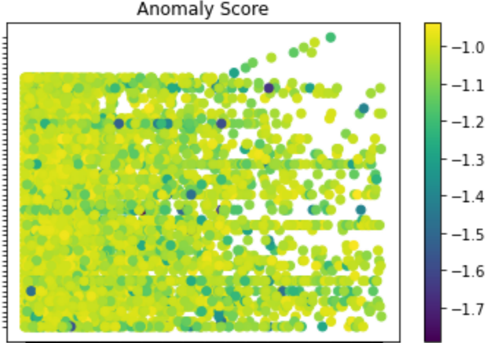

# Open-data-community-lego

I used the anomly detection algorithm for the unsupervised learning because Unsupervised learning algorithms do not require labeled data, which makes them useful in situations where labeled data is scarce or expensive to acquire. These algorithms can be used to discover patterns and structure in the data, such as grouping similar data points together or identifying outliers.

Anomaly detection algorithms, which are a type of unsupervised learning, are often used to detect sybil attacks. These algorithms can identify patterns or behaviors in the data that deviate from the norm, which can indicate the presence of a sybil attack.

There are several libraries in Python that can be used to apply anomaly detection algorithms, such as:

- scikit-learn: a popular machine learning library that includes several anomaly detection algorithms, including LocalOutlierFactor, OneClassSVM, and IsolationForest.
- PyOD: a library specifically designed for anomaly detection, it has several algorithm implementations and is easy to use.
- Tensorflow: a library that can be used to create and train neural network models, including autoencoders which can be used for anomaly detection.

I used the scikit-learn to implement this lego by using its algorithm Localoutlierfactor.

Anomaly scores are a way to quantify how likely a given data point is to be an anomaly. These scores are typically assigned by an anomaly detection algorithm, and are used to identify data points that deviate from the norm or exhibit unusual behavior.

In the example I provided earlier, the LocalOutlierFactor algorithm assigns a negative outlier factor score to each data point, with higher scores indicating a higher likelihood of being an anomaly. The scores are based on the density of the data points in the feature space, and take into account the number of neighboring data points and the distance to the nearest neighbors. Data points with the highest anomaly scores are considered to be the most unusual or deviating from the norm.

Here is the code i wrote for it :-

```
from sklearn.neighbors import LocalOutlierFactor
import pandas as pd

# Load your data into a pandas dataframe
data = pd.read_csv("your_data.csv")

# Define the features you want to use for anomaly detection
X = data[["feature_1", "feature_2", "feature_3"]]

# Create an instance of the LocalOutlierFactor class
lof = LocalOutlierFactor(n_neighbors=20, contamination=0.1)

# Fit the model to your data
lof.fit(X)

# Use the decision_function method to assign a score to each data point
scores = lof.negative_outlier_factor_

# Create a column in your dataframe to store the scores
data["anomaly_score"] = scores

# Identify the data points with the highest anomaly scores
anomalies = data[data["anomaly_score"] < -1]
# highest_score = round(anomalies["anomaly_score"].max(), 2)
# print(highest_score)
highest_index = round(anomalies["anomaly_score"].idxmax(),2)
highest_anomaly = anomalies.loc[highest_index]

#print the highest anomaly score and the corresponding data
print("highest anomaly score:",highest_anomaly["anomaly_score"])
print("highest anomaly data:",highest_anomaly)
anomalies.to_csv('submission.csv')
```
If the anomaly score more towards the negative its a outlier.

all the address in the climate_grant_votes which had the anomaly score less than -1 i uploaded them to the ocean protocol [here](https://market.oceanprotocol.com/asset/did:op:a848ce4806833402651429ab4c6ea79aa940458fbfa26a5bb1c52e0ce600ffc1).



this is a graph showing the anomaly score which are less than -1


This code can be very easily modified to take a address of a person as a input and tell which anomaly score it has to decide if the address is a part of a sybil attack.
The code of the climate grant votes is in the core in the file LOF.py
